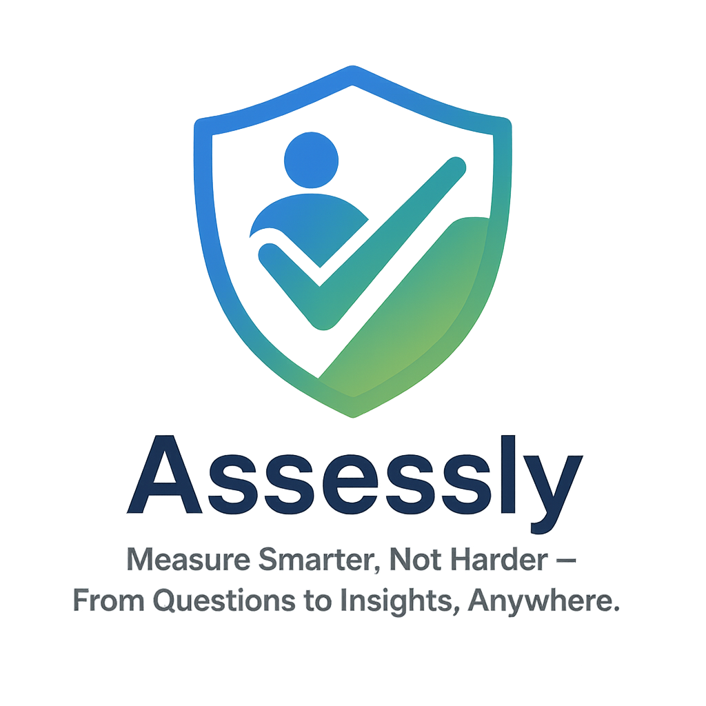

# Assessly Platform



> Measure Smarter, Not Harder – From Questions to Insights, Anywhere.

A modern assessment SaaS platform enabling organizations to create, deliver, and analyze assessments with enterprise-grade reliability.

## Key Features

### Core Capabilities
| Feature | Description |
|---------|-------------|
| **Multi-role System** | Admin, Assessor, and Candidate roles with granular permissions |
| **Assessment Builder** | Drag-and-drop interface with 10+ question types |
| **Smart Analytics** | Real-time dashboards with actionable insights |
| **Offline Mode** | Work without internet with automatic sync |

### Assessment Types
- **Exams & Quizzes**
- **Employee Evaluations**
- **360° Feedback**
- **Surveys & Questionnaires**
- **Certification Tests**

###  Platform Highlights
```mermaid
graph TD
  A[Create Assessment] --> B[Distribute]
  B --> C[Collect Responses]
  C --> D[Generate Reports]
  D --> E[Analyze Insights]


