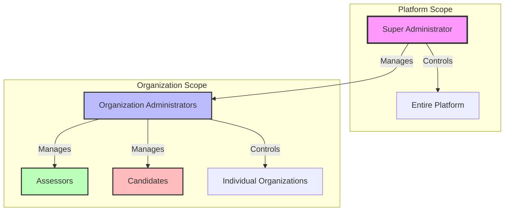
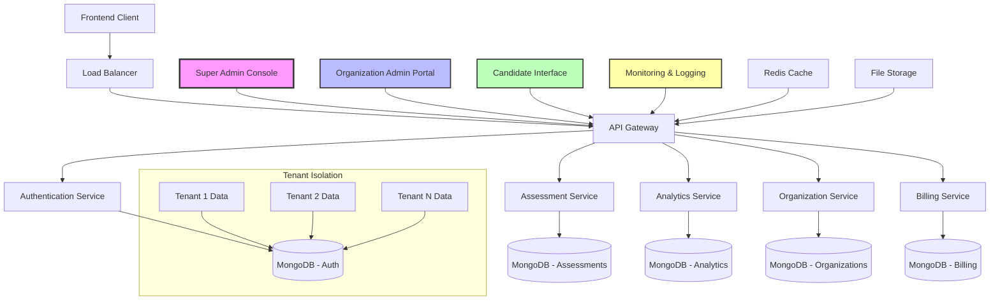

Assessly Platform

https://img.shields.io/badge/Version-1.0.0-blue.svg
https://img.shields.io/badge/Node.js-22.21.1-green.svg
https://img.shields.io/badge/MongoDB-7.0-green.svg
https://img.shields.io/badge/License-MIT-yellow.svg
https://img.shields.io/badge/Architecture-Multi--Tenant-orange.svg
https://img.shields.io/badge/Business-B2B%20SaaS-purple.svg

Measure Smarter, Not Harder – From Questions to Insights, Anywhere.

A modern, enterprise-ready multi-tenant B2B SaaS assessment platform that enables organizations to create, deliver, and analyze assessments with powerful analytics and seamless user experiences. Built with a Super Administrator who controls Organization Administrators for complete platform governance.

🚀 Live Deployment

Environment URL Status
🌐 Frontend Application https://assessly-gedp.onrender.com ✅ Live
⚙️ Backend API https://assesslyplatform-t49h.onrender.com ✅ Live
📚 API Documentation https://assesslyplatform-t49h.onrender.com/api/docs ✅ Live
❤️ Health Check https://assesslyplatform-t49h.onrender.com/api/v1/health ✅ Live
📊 Server Monitor https://assesslyplatform-t49h.onrender.com/api/monitor ✅ Live

🏢 Multi-Tenant Architecture

🎯 Role Hierarchy



🔐 Access Control Matrix

Role Platform Access Organization Access User Management Assessment Management Billing
Super Admin ✅ Full Control ✅ All Organizations ✅ All Users ✅ All Assessments ✅ Full Access
Organization Admin ❌ No Access ✅ Own Organization Only ✅ Own Users Only ✅ Own Assessments Only ❌ View Only
Assessor ❌ No Access ✅ Own Organization ❌ No Access ✅ Assigned Only ❌ No Access
Candidate ❌ No Access ✅ Own Organization ❌ No Access ✅ Assigned Only ❌ No Access

✨ Key Features

🎯 Core Platform Capabilities

· Multi-Tenant B2B SaaS - Complete organization isolation with shared infrastructure
· Hierarchical Role System - Super Admin → Organization Admin → Assessor → Candidate
· Drag & Drop Assessment Builder - Intuitive interface with 15+ question types
· Real-time Analytics Dashboard - AI-powered insights with predictive analytics
· Enterprise Security - SOC 2 compliant, GDPR & HIPAA ready, end-to-end encryption
· API & Integrations - RESTful API with webhooks and pre-built connectors

🏗️ Enterprise Architecture

· Scalable Infrastructure - Auto-scaling microservices built on Node.js & MongoDB
· Data Isolation - Complete separation between organizations
· High Availability - 99.9% uptime SLA with multi-region deployment
· Backup & Recovery - Automatic daily backups with point-in-time recovery
· Performance Optimized - Built for handling thousands of concurrent assessments

📊 Advanced Analytics Suite

· Real-time Performance Dashboards - Live tracking with customizable metrics
· Predictive Analytics Engine - AI-powered insights and trend forecasting
· Custom Report Builder - Create and export reports in PDF/Excel/CSV formats
· Organization-specific Metrics - Tailored analytics for each tenant
· Benchmarking & Comparison - Compare performance across teams and time periods

🛡️ Security & Compliance

· End-to-end Encryption - All data encrypted at rest and in transit
· SOC 2 Compliance - Enterprise-grade security standards
· GDPR & HIPAA Ready - Privacy regulations compliance
· Comprehensive Audit Logs - Full activity tracking and monitoring
· Two-factor Authentication - Enhanced login security
· Role-Based Access Control - Granular permission management

🔌 Integration Ecosystem

· Comprehensive REST API - Full-featured API for custom integrations
· Webhook Support - Real-time event notifications
· Zapier Integration - Connect with 3000+ apps
· HRIS/LMS Integrations - Pre-built connectors for popular systems
· Custom Connector Builder - Create custom integrations easily

📈 Platform at Scale

· 500+ Organizations - Trusted by businesses worldwide
· 12,500+ Assessments - Millions of questions delivered
· 85,000+ Candidates - Global user base
· 250,000+ Questions - Extensive question library
· Multi-language Support - Global accessibility

📋 Assessment Types

· Exams & Certification Tests - Formal testing and certification
· Employee Evaluations - Performance reviews and feedback
· 360° Feedback - Multi-rater assessments
· Surveys & Questionnaires - Research and data collection
· Skills Assessment - Technical and soft skills evaluation
· Personality Tests - Psychological profiling
· Pre-employment Screening - Candidate evaluation
· Course Assessments - eLearning and training evaluation
· Compliance Training - Regulatory and legal compliance

🔄 Assessment Lifecycle

1. 🎨 Create & Design - Drag-and-drop builder with 15+ question types (5 minutes)
2. ⚙️ Configure & Brand - Organization branding and assessment settings (2 minutes)
3. 📤 Distribute & Invite - Send via email, link, or system integration (1 minute)
4. 📈 Monitor & Analyze - Real-time tracking with live dashboards (Ongoing)
5. 📊 Generate Reports - Automated reporting with AI-powered insights (Instant)
6. 🚀 Take Action - Data-driven decisions with actionable insights (Continuous)

🏆 Pricing & Plans

Feature Basic Professional Enterprise
Price (Monthly) $29/month $79/month Custom
Price (Annual) $290/year (Save 17%) $790/year (Save 20%) Custom
Assessments/Month 100 500 Unlimited
Question Types 5 12 All
Team Members 5 25 Unlimited
Storage 5GB 50GB Unlimited
Advanced Analytics ❌ ✅ ✅
API Access ❌ ✅ ✅
Custom Branding ❌ ✅ ✅
Priority Support ❌ ✅ ✅
SSO Integration ❌ ❌ ✅
Dedicated Manager ❌ ❌ ✅
Custom Integrations ❌ ❌ ✅
SLA Guarantee ❌ ❌ 99.9%

🏗️ Architecture Overview



🚀 Quick Start

Prerequisites

· Node.js 18+ and npm
· MongoDB 5.0+
· Git

Installation

```bash
# Clone the repository
git clone https://github.com/yourusername/assessly-platform.git
cd assessly-platform

# Install dependencies
npm install

# Set up environment variables
cp .env.example .env
# Edit .env with your configuration

# Start the development server
npm run dev

# Access the application
# Frontend: http://localhost:5173
# Backend API: http://localhost:5000
# API Docs: http://localhost:5000/api/docs
```

Docker Deployment

```bash
# Build and run with Docker Compose
docker-compose up -d

# Access the application
# Frontend: http://localhost:3000
# Backend: http://localhost:5000
```

📚 API Documentation

Comprehensive API documentation available at /api/docs endpoint:

· Interactive Swagger UI - Test endpoints directly in browser
· OpenAPI Specification - Machine-readable API definition
· Authentication Examples - JWT token usage examples
· Rate Limiting Details - API usage limits and quotas
· Error Code Reference - Complete error handling guide

🔧 Configuration

Environment Variables

```env
# MongoDB Configuration
MONGODB_URI=mongodb://localhost:27017/assessly
MONGODB_ATLAS_URI=your_mongodb_atlas_uri

# JWT Configuration
JWT_SECRET=your_jwt_secret_key_here
JWT_EXPIRE=7d
JWT_COOKIE_EXPIRE=7

# Email Configuration
EMAIL_HOST=smtp.gmail.com
EMAIL_PORT=587
EMAIL_USER=your_email@gmail.com
EMAIL_PASS=your_email_password

# Frontend URL
FRONTEND_URL=http://localhost:5173

# Stripe Configuration (for billing)
STRIPE_SECRET_KEY=your_stripe_secret_key
STRIPE_WEBHOOK_SECRET=your_stripe_webhook_secret
```

📦 Deployment

Render.com (Recommended)

```yaml
# render.yaml
services:
  - type: web
    name: assessly-backend
    env: node
    buildCommand: npm install
    startCommand: npm start
    envVars:
      - key: NODE_ENV
        value: production
      - key: MONGODB_URI
        sync: false
      - key: JWT_SECRET
        generateValue: true

  - type: web
    name: assessly-frontend
    env: static
    buildCommand: npm run build
    staticPublishPath: ./dist
    envVars:
      - key: VITE_API_URL
        value: https://assessly-backend.onrender.com
```

Vercel Deployment

```bash
# Install Vercel CLI
npm i -g vercel

# Deploy frontend
vercel

# Deploy backend
vercel --prod
```

🧪 Testing

```bash
# Run all tests
npm test

# Run specific test suites
npm run test:unit      # Unit tests
npm run test:integration # Integration tests
npm run test:e2e       # End-to-end tests

# Test coverage
npm run test:coverage

# Security audit
npm audit
```

🔐 Security Features

· Helmet.js - Security headers
· CORS - Cross-origin resource sharing
· Rate Limiting - API request throttling
· Input Validation - Joi schema validation
· XSS Protection - Cross-site scripting prevention
· SQL/NoSQL Injection Protection - Query sanitization
· Password Hashing - bcrypt with salt rounds
· JWT Tokens - Stateless authentication
· Cookie Security - HttpOnly, Secure flags

📈 Monitoring & Logging

Built-in Monitoring

```javascript
// Health check endpoint
GET /api/v1/health

// Status monitoring
GET /api/monitor

// Performance metrics
GET /api/metrics

// System information
GET /api/system/info
```

Logging Levels

· ERROR - Critical issues requiring immediate attention
· WARN - Potential problems that need monitoring
· INFO - General operational information
· DEBUG - Detailed debugging information
· HTTP - HTTP request/response logging

🤝 Contributing

We welcome contributions! Please see our Contributing Guidelines for details.

1. Fork the repository
2. Create your feature branch (git checkout -b feature/AmazingFeature)
3. Commit your changes (git commit -m 'Add some AmazingFeature')
4. Push to the branch (git push origin feature/AmazingFeature)
5. Open a Pull Request

📄 License

This project is licensed under the MIT License - see the LICENSE file for details.

🆘 Support

· Documentation: https://docs.assesslyplatform.com
· Community Forum: https://community.assesslyplatform.com
· Email Support: support@assesslyplatform.com
· Enterprise Support: enterprise@assesslyplatform.com
· Slack Community: Join our Slack

🙏 Acknowledgments

· Built with ❤️ by the Assessly Team
· Powered by Node.js, Express, React, and MongoDB
· Icons by Material-UI
· Deployment by Render.com
· Analytics by Chart.js

---

<div align="center">
  <h3>🚀 Ready to Transform Your Assessment Process?</h3>
  <p>
    <a href="https://assessly-gedp.onrender.com/register">Start Free Trial</a> •
    <a href="https://assessly-gedp.onrender.com/contact">Request Demo</a> •
    <a href="https://github.com/linolazaxous/assesslyplatform">View on GitHub</a>
  </p>
  <p><em>No credit card required • 14-day free trial • Support included</em></p>
</div>
